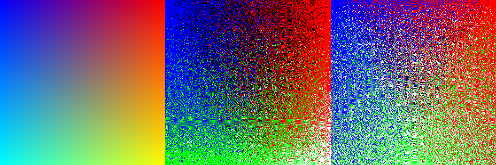

# Ditherpy

`ditherpy` is a simple library for dithering. It implements both linearising the input image and a perception-corrected distance function. See [this Stackoverflow thread](https://stackoverflow.com/questions/596216/formula-to-determine-perceived-brightness-of-rgb-color/56678483#56678483) for details on colour-correction.

You can provide a custom palette and toggle the colour-correction measures.

See [obrhubr.org/dithering-in-colour](https://obrhubr.org/dithering-in-colour) for more details.

### Usage

Install `pip3 install numpy Pillow tqdm`. 
Run `python3 demo.py` to generate two demo images, one of Dürer's "Young Hare" and a gradient.





The first image is the original, the second the linearised and third the non-linearised dithered image.

### Usage as a library

Import `from ditherpy import Dither`.
 - choose the colour space to use `colour_space` from `"srgb"|"lin-srgb"|"oklab"`.
 - choose the dithering diffusion matrix `mode="Atkinson"|"FloydSteinberg"`.
 - toggle a dynamic palette based on the image's colours `dynamic_palette=True|False`.

Load your image with Pillow into a numpy array, choose a palette and then run: 

```python
image = Image.open("input.jpg").convert("RGB")

# Choose a palette
# Array of arrays of RGB values
palette = np.array([[0, 0, 0], [255, 255, 255]])

dithered = Dither(options...).dither(image, palette)
```
